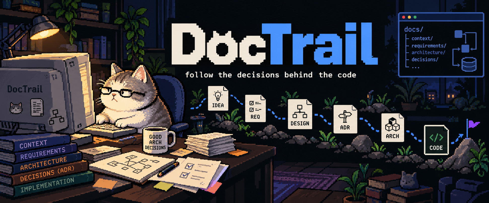
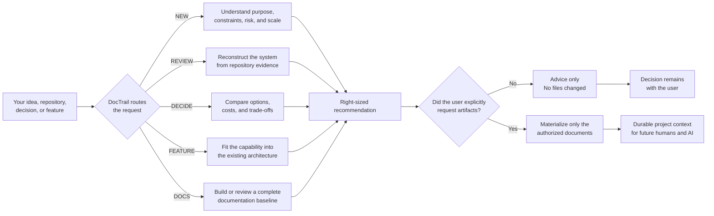
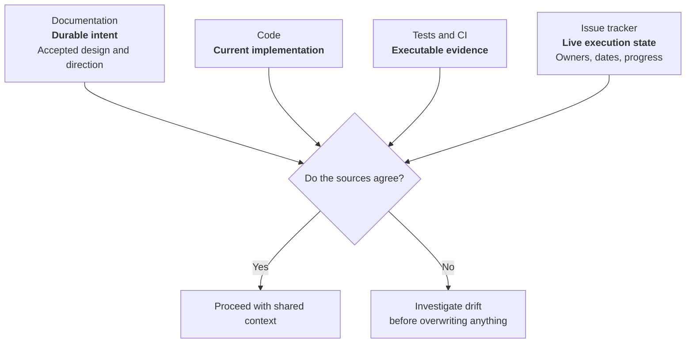

<div align="center">



**An Agent Skill that turns architectural reasoning into durable project context — so your next AI session can understand the decisions, constraints, and direction without making you explain everything again.**

### Works with

<strong>Verified</strong><br />
<code>✓ OpenAI Codex</code>

<br />

<strong>Compatible</strong><br />
<code>Claude Code</code> · <code>Cursor</code> · <code>GitHub Copilot</code> · <code>Gemini CLI</code> · <code>Grok Code</code> · <code>OpenCode</code>

<br />

<sub>One skill. Multiple agents. Portable core built on the open <a href="https://agentskills.io/specification">Agent Skills format</a>.</sub><br />
<sub><strong>Verified</strong> means the package passed Codex's skill validator. <strong>Compatible</strong> means the host documents support for this skill format or discovery path; it does not mean DocTrail's behavior has been tested on that host. Grok Code uses Grok Build's documented Agent Skills support and remains unverified behaviorally.</sub>

<br />

<sub><strong>Agent Skills compatible</strong> · ✓ Validated on Codex · 21 adversarial eval contracts</sub>

[Why DocTrail](#why-doctrail) · [How it works](#how-it-works) · [Compare](#how-it-compares) · [Install](#installation) · [Try it](#try-it)

</div>

---

## The chat reset problem

You spend an hour explaining your project to an AI:

- why the app exists;
- why you chose one database over another;
- which boundaries must not be crossed;
- which ideas are committed and which are only possibilities;
- what failed before;
- what should happen next.

The session ends.

Next week, a new chat sees the repository but not the reasoning. It can read the code, but it cannot reliably tell which parts are intentional, accidental, incomplete, or obsolete. You repeat the context — or the agent invents it.

> **Chat history is temporary. Project intent should be durable.**

DocTrail helps your AI inspect the real project, make proportionate architecture decisions, and — only when you ask — leave behind useful documentation that future humans and AI sessions can follow.

## Before and after

| Without DocTrail | With DocTrail |
|---|---|
| “Let me explain the architecture again…” | The project carries its durable context forward. |
| A new agent guesses intent from folders and frameworks. | The agent separates observed code, documented intent, inference, and unknowns. |
| Every idea becomes scope — or disappears from the plan. | Ideas remain `COMMITTED`, `RECOMMENDED`, `FUTURE`, or `NOT RECOMMENDED`. |
| Architecture advice defaults to fashionable complexity. | Complexity must earn its place from real constraints. |
| A roadmap appears even when nobody asked for one. | Planning is optional; milestones are optional too. |
| Old decisions are silently rewritten. | Significant decisions keep history and explicit revisit triggers. |
| Documentation competes with code for “the truth.” | Drift is investigated; no source wins automatically. |

## Why DocTrail

Most architecture guidance fails in one of two ways:

1. **Too little context.** The agent recommends a stack or pattern before understanding who the project is for, what can go wrong, or how it will be maintained.
2. **Too much ceremony.** A personal tool gets treated like a venture-backed platform and receives microservices, ten documents, and a roadmap it never needed.

DocTrail uses **right-sized architecture**:

> Apply the minimum architecture, documentation, assurance, and planning that reasonably satisfies the project's real needs and foreseeable constraints.

Those four dimensions are independent. A small financial MVP may need rigorous assurance but a simple topology. A mature personal utility may need almost no planning but excellent backup documentation.

## How it works

DocTrail normally chooses an internal route from the request. Optional selectors let you choose one explicitly without learning a separate command for every workflow.



### The five routes

The main skill is `doctrail`. It normally picks a route automatically. You can optionally pass one selector (`idea`, `review`, `decide`, `docs`, or `feature`) after invoking it to choose a workflow. These are arguments to the single skill—not separate skills or standalone slash commands. A selector does not authorize file changes or override your scope and constraints.

| Route | Optional selector | Use it for | Typical result |
|---|---|---|---|
| `NEW` | `idea` | A new idea or project | Context profile, proportional architecture, technology guidance |
| `REVIEW` | `review` | An existing repository | Evidence-based architecture reconstruction and prioritized findings |
| `DECIDE` | `decide` | A focused technical choice | Recommendation, alternatives, trade-offs, and revisit conditions |
| `DOCS` | `docs` | A complete project-documentation baseline | Requirements-led context, functionality, architecture, and quality/operations docs |
| `FEATURE` | `feature` | Adding a capability | Existing-logic review, ownership, boundaries, integration path, and architecture implications |

Examples: `Use $doctrail docs to document this project` in Codex, or `/doctrail docs` in Claude Code or Cursor.

## Context that survives the chat

DocTrail does not declare one universal source of truth. It gives each source a job:



This matters when you return months later. The code may have moved ahead of the docs. A test may encode an outdated behavior. An ADR may have been superseded. DocTrail makes the disagreement visible instead of silently picking a winner.

## What it can document

DocTrail starts in **advisory mode**. It writes files only when you explicitly request them or approve a proposed artifact set.

| Artifact | What it preserves | When it is useful |
|---|---|---|
| Core documentation areas | Context, functionality, architecture, and quality/operations, with three concise visual views | Whenever a complete project-documentation set is requested; concise even for a small project |
| Requirements and traceability | Stable RF/RNF/business-rule IDs, source disposition, acceptance, verification, and links across stories, design, and tests | For every complete baseline; depth grows with risk and complexity, not verbosity |
| Stories and use cases | Brief user stories per capability; detailed use cases for flows with real rules, alternatives, failures, or risk | To explain user intent and important interactions without repeating conventional behavior |
| Project profile | Purpose, audience, constraints, risk, assumptions | When future decisions need stable context |
| Architecture detail | The required overview includes system boundaries and the baseline C4 context view; expand into building blocks, data, integrations, runtime, and deployment as warranted | When additional structure or risk needs a durable shared model |
| ADR | A significant decision, its alternatives, consequences, and revisit trigger; stored under `docs/02-arquitectura/adr/` by default | When future contributors may question or reverse the choice |
| Documentation index | Navigation across the core areas and other project documents; `docs/indice.md` is the default root index | As the root entry point for a complete documentation baseline |
| `AGENTS.md` guidance | Short instructions telling future agents what existing docs to consult | When agent behavior should consistently respect project context |
| Delivery direction | Outcomes, dependencies, risks, gates, and optional milestones | When sequencing adds value |
| Future capabilities | Ideas worth preserving without promising delivery | When possibilities outgrow a small roadmap section |

No empty placeholders. A complete documentation set has four concise core areas and requirement identifiers; planning remains optional. No ADR for a trivial preference. No `AGENTS.md` rewrite. No roadmap just because the project exists.

For a complete baseline, each functional requirement (`RF`) and non-functional requirement (`RNF`) has a source, scope decision, acceptance or quality target, and verification method. A short user story captures each meaningful user-facing capability; detailed use cases are reserved for flows with real rules, alternatives, failures, or risk. A conventional login does not need a long scripted use case. A compact traceability map lets an agent follow a capability into its design and tests without repeating its full explanation.

## How it compares

| Capability | Chat-only prompting | Generic documentation generator | DocTrail |
|---|:---:|:---:|:---:|
| Context survives a new conversation | ❌ | ✅ | ✅ |
| Inspects an existing repository before judging it | Sometimes | Rarely | ✅ |
| Separates fact, documentation, inference, and unknowns | ❌ | ❌ | ✅ |
| Adjusts for personal vs. commercial use | ❌ | Sometimes | ✅ |
| Keeps architecture, assurance, docs, and planning independent | ❌ | ❌ | ✅ |
| Preserves rejected or future ideas without committing them | ❌ | Sometimes | ✅ |
| Supports ADR lifecycle and superseding | ❌ | Sometimes | ✅ |
| Allows roadmaps without milestones | N/A | Sometimes | ✅ |
| Respects explicit “no planning” or “analysis only” | Depends | Depends | ✅ |
| Requires explicit authorization before writing artifacts | Depends | ❌ | ✅ |
| Acts as a live issue tracker | ❌ | Sometimes | **Intentionally no** |

DocTrail is not a replacement for GitHub Issues, Linear, Notion, or your project board. It preserves durable technical direction; those systems preserve live execution state.

## Evidence before opinion

For an existing repository, material findings use three independent dimensions:

```text
Basis:      OBSERVED | DOCUMENTED | INFERRED | UNVERIFIED
Assessment: GOOD | WARNING | PROBLEM | DECISION NEEDED
Confidence: high | medium | low
```

That distinction prevents common review mistakes:

- an undocumented component is not automatically bad;
- an abstraction with one implementation is not automatically overengineering;
- missing microservices are not underengineering;
- an accepted document is not proof that the code still follows it;
- an unverified risk is not the same as a confirmed defect.

## Decisions with an exit door

Important recommendations follow a compact contract:

```text
Recommendation
Why
Alternatives
Trade-offs
Revisit when
```

`Revisit when` keeps a good decision from becoming permanent dogma. A monolith can remain the right choice until independent deployments, ownership boundaries, or measured bottlenecks appear. A local database can remain enough until synchronization becomes a real requirement.

## Planning without project-management theater

Planning can be:

- outside the request;
- explicitly declined;
- assessed as unnecessary;
- requested by the user;
- recommended because sequencing would reduce risk.

When useful, DocTrail can organize work as next steps, phases, Now/Next/Later, capability sequences, outcome milestones, or release gates. It does not impose Scrum, backend-first, frontend-first, or a fixed hierarchy.

For a complete documentation baseline, the four core areas are created regardless of planning preference. If that preference is unknown, DocTrail asks whether to omit planning, keep a Markdown plan in the repository, or use an existing issues/board system; it can continue with the core baseline while awaiting the answer. It does not duplicate live issue status in Markdown, and milestones remain optional.

A thin end-to-end walking skeleton is preferred when it produces earlier learning. Backend-first, UI-first, infrastructure-first, or a technical spike can still be correct when the project's main uncertainty points there.

## Try it

### Assess a new project

```text
Use $doctrail to assess this idea, identify the real constraints,
and recommend the simplest architecture that fits. Advice only.
```

### Review an existing repository

```text
Use $doctrail to reconstruct this repository's architecture.
Separate observed facts, documented intent, inference, and unknowns.
Do not modify files.
```

### Make a focused decision

```text
Use $doctrail to decide whether this project needs PostgreSQL
or whether SQLite is enough. Include trade-offs and revisit triggers.
```

### Add a feature

```text
Use $doctrail to decide where refunds belong in the existing
architecture before proposing a new service.
```

### Preserve a long-term direction

```text
Use $doctrail to create a technical delivery plan. Keep mandatory,
recommended, and future ideas separate. Do not invent dates or owners.
```

## Installation

DocTrail is both the product and the primary skill. The installable skill directory is `doctrail/`; its short description is project architecture and documentation. Always copy the complete directory so its references, templates, scripts, and assets stay together.

### Primary: DocTrail npm CLI

```bash
npx --yes @iovargasjeff/doctrail@latest
```

This installs DocTrail into the current project using the official Agent Skills CLI underneath. Add `--global` for a user-wide install or select a host with `--agent`:

```bash
npx --yes @iovargasjeff/doctrail@latest install --global --agent codex
```

The public npm package is [`@iovargasjeff/doctrail`](https://www.npmjs.com/package/@iovargasjeff/doctrail). Automatic publishing is verified: GitHub Actions published `v0.1.1` using npm Trusted Publishing (OIDC). Release Please proposes new versions, which are published after a reviewed release PR is merged; see [the release guide](docs/releasing.md).

The bundled commands are:

| Command | Purpose |
|---|---|
| `install` (default) | Install the bundled skill. Repeated installs are no-ops; existing unmanaged or modified copies are not silently replaced. |
| `scan [path] --format markdown or json` | Read-only repository inventory; requires Python 3.11+. |
| `doctor` | Check Node/Python runtimes, skill installation, recorded integrity, and version drift. |
| `update` | Explicitly update DocTrail from the CLI package version currently being run. |
| `uninstall` | Remove only the `doctrail` skill in the selected scope. |

```bash
npx --yes @iovargasjeff/doctrail@latest scan . --format json
npx --yes @iovargasjeff/doctrail@latest doctor
npx --yes @iovargasjeff/doctrail@latest update
npx --yes @iovargasjeff/doctrail@latest uninstall
```

The CLI requires Node.js 22.20 or newer. Python 3.11 or newer is needed only by `scan` (set `DOCTRAIL_PYTHON` to choose a specific executable). Update and removal check the installed skill's integrity; when local changes are detected, an interactive confirmation is required, or pass `--force` after reviewing them. New npm releases do not update installed copies automatically; each user chooses when to run `update`. DocTrail collects no telemetry and disables telemetry in the upstream installer it invokes.

### Alternative: use the generic Agent Skills CLI directly

```bash
npx skills add iovargasjeff/DocTrail@doctrail
```

This installs the skill from GitHub without DocTrail's npm wrapper commands. The generic CLI also supports selecting agents, `skills update doctrail`, and `skills remove doctrail`. See [issue #9](https://github.com/iovargasjeff/DocTrail/issues/9) for cross-host verification work; successful installation alone is not a behavioral compatibility test.

#### Updating from the earlier skill name

The previous release used the skill slug `project-architect`. Remove that old skill directory from each scope where you installed it, then install or copy `doctrail/`. Keeping both directories can make an agent discover two copies of the same skill.

### 1. Clone DocTrail

```bash
git clone https://github.com/iovargasjeff/DocTrail.git
cd DocTrail
```

### 2. Install for your agent

#### Shared Agent Skills path

One project-scoped installation in `.agents/skills/` is discovered by **Codex, Cursor, GitHub Copilot, Gemini CLI, and OpenCode**. Grok Code discovers user-level skills in `~/.agents/skills/` and project skills in `.grok/skills/`; its host-specific paths are listed below.

| Scope | Destination |
|---|---|
| User | `~/.agents/skills/doctrail/` |
| Project | `<project>/.agents/skills/doctrail/` |

User installation on macOS or Linux:

```bash
mkdir -p ~/.agents/skills
cp -R doctrail ~/.agents/skills/
```

User installation on Windows PowerShell:

```powershell
New-Item -ItemType Directory -Force "$env:USERPROFILE\.agents\skills" | Out-Null
Copy-Item -Recurse -Force .\doctrail "$env:USERPROFILE\.agents\skills"
```

For a project-only installation, replace the destination with `.agents/skills/doctrail` inside that repository.

#### Claude Code

Claude Code uses its own discovery directory rather than `.agents/skills/`.

macOS or Linux:

```bash
mkdir -p ~/.claude/skills
cp -R doctrail ~/.claude/skills/
```

Windows PowerShell:

```powershell
New-Item -ItemType Directory -Force "$env:USERPROFILE\.claude\skills" | Out-Null
Copy-Item -Recurse -Force .\doctrail "$env:USERPROFILE\.claude\skills"
```

For a project-only installation, use `.claude/skills/doctrail` inside that repository.

#### Native project paths

The shared path is the smallest setup. These documented native locations are also available when a repository should target one host explicitly:

| Agent | User scope | Project scope | Documentation |
|---|---|---|---|
| OpenAI Codex | `~/.agents/skills/` | `.agents/skills/` | [Skills](https://developers.openai.com/codex/skills) |
| Claude Code | `~/.claude/skills/` | `.claude/skills/` | [Skills](https://code.claude.com/docs/en/skills) |
| Cursor | `~/.cursor/skills/` or `~/.agents/skills/` | `.cursor/skills/` or `.agents/skills/` | [Agent Skills](https://prod.cursor.com/docs/skills) |
| GitHub Copilot | `~/.copilot/skills/` or `~/.agents/skills/` | `.github/skills/` or `.agents/skills/` | [Adding agent skills](https://docs.github.com/en/copilot/how-tos/copilot-on-github/customize-copilot/customize-cloud-agent/add-skills) |
| Gemini CLI | `~/.gemini/skills/` or `~/.agents/skills/` | `.gemini/skills/` or `.agents/skills/` | [Managing Agent Skills](https://github.com/google-gemini/gemini-cli/blob/main/docs/cli/using-agent-skills.md) |
| OpenCode | `~/.config/opencode/skills/` or `~/.agents/skills/` | `.opencode/skills/` or `.agents/skills/` | [Agent Skills](https://opencode.ai/docs/skills) |
| Grok Code (Grok Build) | `~/.grok/skills/` or `~/.agents/skills/` | `.grok/skills/` | [Skills, plugins, and marketplaces](https://docs.x.ai/build/features/skills-plugins-marketplaces) |

`agents/openai.yaml` adds Codex presentation metadata only. The portable behavior lives in `SKILL.md`, `references/`, and `assets/`; other hosts can ignore the OpenAI metadata.

### 3. Invoke it

Codex supports explicit `$` invocation:

```text
Use $doctrail review to review this project's architecture.
```

Claude Code and Cursor expose installed skills through `/doctrail`. Across all compatible hosts, a normal request also works:

```text
Use the DocTrail skill to review this project's architecture.
```

Hosts may select it automatically for architecture assessment, technical decisions, repository reviews, requirements-led project documentation, feature fit, and technical delivery planning. It should not activate merely because ordinary implementation begins.

## Inside the skill

```text
doctrail/
├── SKILL.md                       # Activation, shared behavior, routing
├── agents/
│   └── openai.yaml               # Codex UI metadata
├── references/
│   ├── project-assessment.md
│   ├── technology-decisions.md
│   ├── architecture-patterns.md
│   ├── c4-arc42.md
│   ├── adr-guidelines.md
│   ├── documentation-strategy.md
│   ├── requirements-engineering.md
│   ├── delivery-planning.md
│   └── existing-project-review.md
├── assets/                        # Architecture, functional, requirements, quality, and plan templates
├── scripts/                       # Documentation validator and read-only repository inventory
└── evals/                         # 21 adversarial scenario contracts (repository only; not in npm package)
```

`SKILL.md` stays focused on shared rules and routing. Detailed guidance is loaded only when the request needs it, keeping unrelated context out of the conversation.

## Guardrails

DocTrail deliberately does **not**:

- activate only because you started building something;
- write architecture artifacts without explicit authorization;
- force detailed C4 levels (containers/components/deployment), full arc42 coverage, roadmaps, or milestones; a complete baseline does include a minimal C4 context plus functional use-case and primary-sequence views;
- treat a personal tool like a public startup;
- erase ideas because they are not recommended now;
- turn durable documentation into a mirror of live tickets;
- claim that documentation, code, or tests always win a disagreement;
- veto a viable choice after you understand and accept its trade-offs.

## Validation

The skill passes structural validation. Its 21 adversarial scenario contracts cover:

- simple CRUD and accidental overengineering;
- brownfield repository review;
- high-assurance fintech and critical systems;
- feature integration;
- explicit planning opt-outs;
- Kanban without milestones;
- ambiguous authorization;
- external roadmaps;
- personal-use applications;
- preservation of future ideas;
- the required small-project documentation baseline with planning left optional;
- proceeding with core documentation while the optional planning choice is pending;
- required diagrams and an AI navigation pointer without rewriting existing agent instructions;
- proportional growth of documentation for a larger multi-unit product;
- concise requirements and user stories without verbose conventional login use cases;
- feature intake that keeps adjacent recommendations out of accepted scope.
- explicit route selectors that do not grant permission to edit files;
- broad brownfield review with bounded repository inventory;
- safe host-native inventory fallback when Python is unavailable.

Run `npm run check` for the skill/package checks and test suite, `npm run evals` to validate the 21 scenario contracts, and `python doctrail/scripts/validate_docs.py <docs-root>` for structural, link, and identifier checks on generated documentation. The repository inventory is available with `python doctrail/scripts/repository_inventory.py <repo-root> --format markdown|json`; if Python is unavailable during an agent review, use host-native file-listing tools and disclose that the helper did not run. Automated checks validate structure and deterministic script behavior; they do not run an LLM or prove that requirements are true, semantically complete, or behaviorally compatible with every host. Human review of source coverage and live host-specific evals remains necessary.

---

<div align="center">

**Your AI should not have to rediscover the project every time. Leave a trail.**

</div>
