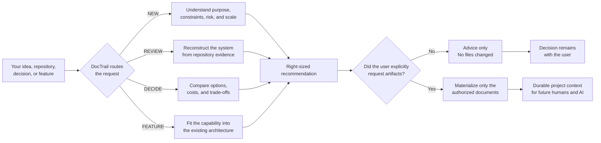
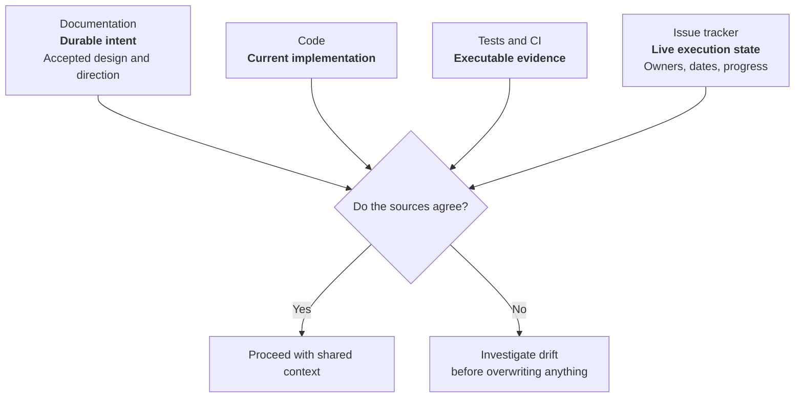

<div align="center">


**An Agent Skill that turns architectural reasoning into durable project context — so your next AI session can understand the decisions, constraints, and direction without making you explain everything again.**

### Works with

<strong>Verified</strong><br />
<code>✓ OpenAI Codex</code>

<br />

<strong>Compatible</strong><br />
<code>Claude Code</code> · <code>Cursor</code> · <code>GitHub Copilot</code> · <code>Gemini CLI</code> · <code>OpenCode</code>

<br />

<sub>One skill. Multiple agents. Portable core built on the open <a href="https://agentskills.io/specification">Agent Skills format</a>.</sub><br />
<sub><strong>Verified</strong> means the package passed Codex's skill validator. <strong>Compatible</strong> means the host officially supports DocTrail's current <code>SKILL.md</code> package structure; those hosts are not yet in DocTrail's eval matrix.</sub>

<br />

<sub><strong>Agent Skills compatible</strong> · ✓ Validated on Codex · 12 adversarial evals</sub>

[Why DocTrail](#why-doctrail) · [How it works](#how-it-works) · [Compare](#how-it-compares) · [Install](#installation) · [Try it](#try-it)

</div>

---

## The chat reset problem

You spend an hour explaining your project to an AI:

- why the app exists;
- why you chose one database over another;
- which boundaries must not be crossed;
- which ideas are committed and which are only possibilities;
- what failed before;
- what should happen next.

The session ends.

Next week, a new chat sees the repository but not the reasoning. It can read the code, but it cannot reliably tell which parts are intentional, accidental, incomplete, or obsolete. You repeat the context — or the agent invents it.

> **Chat history is temporary. Project intent should be durable.**

DocTrail helps your AI inspect the real project, make proportionate architecture decisions, and — only when you ask — leave behind useful documentation that future humans and AI sessions can follow.

## Before and after

| Without DocTrail | With DocTrail |
|---|---|
| “Let me explain the architecture again…” | The project carries its durable context forward. |
| A new agent guesses intent from folders and frameworks. | The agent separates observed code, documented intent, inference, and unknowns. |
| Every idea becomes scope — or disappears from the plan. | Ideas remain `COMMITTED`, `RECOMMENDED`, `FUTURE`, or `NOT RECOMMENDED`. |
| Architecture advice defaults to fashionable complexity. | Complexity must earn its place from real constraints. |
| A roadmap appears even when nobody asked for one. | Planning is optional; milestones are optional too. |
| Old decisions are silently rewritten. | Significant decisions keep history and explicit revisit triggers. |
| Documentation competes with code for “the truth.” | Drift is investigated; no source wins automatically. |

## Why DocTrail

Most architecture guidance fails in one of two ways:

1. **Too little context.** The agent recommends a stack or pattern before understanding who the project is for, what can go wrong, or how it will be maintained.
2. **Too much ceremony.** A personal tool gets treated like a venture-backed platform and receives microservices, ten documents, and a roadmap it never needed.

DocTrail uses **right-sized architecture**:

> Apply the minimum architecture, documentation, assurance, and planning that reasonably satisfies the project's real needs and foreseeable constraints.

Those four dimensions are independent. A small financial MVP may need rigorous assurance but a simple topology. A mature personal utility may need almost no planning but excellent backup documentation.

## How it works

DocTrail chooses an internal route from the request. You do not need to learn subcommands or select a workflow manually.



### The four routes

| Route | Use it for | Typical result |
|---|---|---|
| `NEW` | A new idea or project | Context profile, proportional architecture, technology guidance |
| `REVIEW` | An existing repository | Evidence-based architecture reconstruction and prioritized findings |
| `DECIDE` | A focused technical choice | Recommendation, alternatives, trade-offs, and revisit conditions |
| `FEATURE` | Adding a capability | Ownership, boundaries, integration path, and architecture implications |

## Context that survives the chat

DocTrail does not declare one universal source of truth. It gives each source a job:



This matters when you return months later. The code may have moved ahead of the docs. A test may encode an outdated behavior. An ADR may have been superseded. DocTrail makes the disagreement visible instead of silently picking a winner.

## What it can document

DocTrail starts in **advisory mode**. It writes files only when you explicitly request them or approve a proposed artifact set.

| Artifact | What it preserves | When it is useful |
|---|---|---|
| Project profile | Purpose, audience, constraints, risk, assumptions | When future decisions need stable context |
| Architecture document | Boundaries, building blocks, data, integrations, runtime and deployment | When the system needs a shared structural model |
| ADR | A significant decision, its alternatives, consequences, and revisit trigger | When future contributors may question or reverse the choice |
| Documentation index | Navigation across real project documents | When documentation is no longer obvious to discover |
| `AGENTS.md` guidance | Short instructions telling future agents what existing docs to consult | When agent behavior should consistently respect project context |
| Delivery direction | Outcomes, dependencies, risks, gates, and optional milestones | When sequencing adds value |
| Future capabilities | Ideas worth preserving without promising delivery | When possibilities outgrow a small roadmap section |

No empty documentation tree. No ADR for a trivial preference. No `AGENTS.md` rewrite. No roadmap just because the project exists.

## How it compares

| Capability | Chat-only prompting | Generic documentation generator | DocTrail |
|---|:---:|:---:|:---:|
| Context survives a new conversation | ❌ | ✅ | ✅ |
| Inspects an existing repository before judging it | Sometimes | Rarely | ✅ |
| Separates fact, documentation, inference, and unknowns | ❌ | ❌ | ✅ |
| Adjusts for personal vs. commercial use | ❌ | Sometimes | ✅ |
| Keeps architecture, assurance, docs, and planning independent | ❌ | ❌ | ✅ |
| Preserves rejected or future ideas without committing them | ❌ | Sometimes | ✅ |
| Supports ADR lifecycle and superseding | ❌ | Sometimes | ✅ |
| Allows roadmaps without milestones | N/A | Sometimes | ✅ |
| Respects explicit “no planning” or “analysis only” | Depends | Depends | ✅ |
| Requires explicit authorization before writing artifacts | Depends | ❌ | ✅ |
| Acts as a live issue tracker | ❌ | Sometimes | **Intentionally no** |

DocTrail is not a replacement for GitHub Issues, Linear, Notion, or your project board. It preserves durable technical direction; those systems preserve live execution state.

## Evidence before opinion

For an existing repository, material findings use three independent dimensions:

```text
Basis:      OBSERVED | DOCUMENTED | INFERRED | UNVERIFIED
Assessment: GOOD | WARNING | PROBLEM | DECISION NEEDED
Confidence: high | medium | low
```

That distinction prevents common review mistakes:

- an undocumented component is not automatically bad;
- an abstraction with one implementation is not automatically overengineering;
- missing microservices are not underengineering;
- an accepted document is not proof that the code still follows it;
- an unverified risk is not the same as a confirmed defect.

## Decisions with an exit door

Important recommendations follow a compact contract:

```text
Recommendation
Why
Alternatives
Trade-offs
Revisit when
```

`Revisit when` keeps a good decision from becoming permanent dogma. A monolith can remain the right choice until independent deployments, ownership boundaries, or measured bottlenecks appear. A local database can remain enough until synchronization becomes a real requirement.

## Planning without project-management theater

Planning can be:

- outside the request;
- explicitly declined;
- assessed as unnecessary;
- requested by the user;
- recommended because sequencing would reduce risk.

When useful, DocTrail can organize work as next steps, phases, Now/Next/Later, capability sequences, outcome milestones, or release gates. It does not impose Scrum, backend-first, frontend-first, or a fixed hierarchy.

A thin end-to-end walking skeleton is preferred when it produces earlier learning. Backend-first, UI-first, infrastructure-first, or a technical spike can still be correct when the project's main uncertainty points there.

## Try it

### Assess a new project

```text
Use $project-architect to assess this idea, identify the real constraints,
and recommend the simplest architecture that fits. Advice only.
```

### Review an existing repository

```text
Use $project-architect to reconstruct this repository's architecture.
Separate observed facts, documented intent, inference, and unknowns.
Do not modify files.
```

### Make a focused decision

```text
Use $project-architect to decide whether this project needs PostgreSQL
or whether SQLite is enough. Include trade-offs and revisit triggers.
```

### Add a feature

```text
Use $project-architect to decide where refunds belong in the existing
architecture before proposing a new service.
```

### Preserve a long-term direction

```text
Use $project-architect to create a technical delivery plan. Keep mandatory,
recommended, and future ideas separate. Do not invent dates or owners.
```

## Installation

DocTrail is the project; `project-architect/` is the installable skill directory. Always copy the complete directory so its references, templates, and evals stay together.

### 1. Clone DocTrail

```bash
git clone https://github.com/iovargasjeff/DocTrail.git
cd DocTrail
```

### 2. Install for your agent

#### Shared Agent Skills path

One installation in `.agents/skills/` is discovered by **Codex, Cursor, GitHub Copilot, Gemini CLI, and OpenCode**. Use the user path for all projects or the project path when the skill should travel with one repository.

| Scope | Destination |
|---|---|
| User | `~/.agents/skills/project-architect/` |
| Project | `<project>/.agents/skills/project-architect/` |

User installation on macOS or Linux:

```bash
mkdir -p ~/.agents/skills
cp -R project-architect ~/.agents/skills/
```

User installation on Windows PowerShell:

```powershell
New-Item -ItemType Directory -Force "$env:USERPROFILE\.agents\skills" | Out-Null
Copy-Item -Recurse -Force .\project-architect "$env:USERPROFILE\.agents\skills"
```

For a project-only installation, replace the destination with `.agents/skills/project-architect` inside that repository.

#### Claude Code

Claude Code uses its own discovery directory rather than `.agents/skills/`.

macOS or Linux:

```bash
mkdir -p ~/.claude/skills
cp -R project-architect ~/.claude/skills/
```

Windows PowerShell:

```powershell
New-Item -ItemType Directory -Force "$env:USERPROFILE\.claude\skills" | Out-Null
Copy-Item -Recurse -Force .\project-architect "$env:USERPROFILE\.claude\skills"
```

For a project-only installation, use `.claude/skills/project-architect` inside that repository.

#### Native project paths

The shared path is the smallest setup. These documented native locations are also available when a repository should target one host explicitly:

| Agent | User scope | Project scope | Documentation |
|---|---|---|---|
| OpenAI Codex | `~/.agents/skills/` | `.agents/skills/` | [Skills](https://developers.openai.com/codex/skills) |
| Claude Code | `~/.claude/skills/` | `.claude/skills/` | [Skills](https://code.claude.com/docs/en/skills) |
| Cursor | `~/.cursor/skills/` or `~/.agents/skills/` | `.cursor/skills/` or `.agents/skills/` | [Agent Skills](https://prod.cursor.com/docs/skills) |
| GitHub Copilot | `~/.copilot/skills/` or `~/.agents/skills/` | `.github/skills/` or `.agents/skills/` | [Adding agent skills](https://docs.github.com/en/copilot/how-tos/copilot-on-github/customize-copilot/customize-cloud-agent/add-skills) |
| Gemini CLI | `~/.gemini/skills/` or `~/.agents/skills/` | `.gemini/skills/` or `.agents/skills/` | [Managing Agent Skills](https://github.com/google-gemini/gemini-cli/blob/main/docs/cli/using-agent-skills.md) |
| OpenCode | `~/.config/opencode/skills/` or `~/.agents/skills/` | `.opencode/skills/` or `.agents/skills/` | [Agent Skills](https://opencode.ai/docs/skills) |

`agents/openai.yaml` adds Codex presentation metadata only. The portable behavior lives in `SKILL.md`, `references/`, and `assets/`; other hosts can ignore the OpenAI metadata.

### 3. Invoke it

Codex supports explicit `$` invocation:

```text
Use $project-architect to review this project's architecture.
```

Claude Code and Cursor expose installed skills through `/project-architect`. Across all compatible hosts, a normal request also works:

```text
Use the project-architect skill to review this project's architecture.
```

Hosts may select it automatically for architecture assessment, technical decisions, repository reviews, architecture documentation, and technical delivery planning. It should not activate merely because ordinary implementation begins.

## Inside the skill

```text
project-architect/
├── SKILL.md                       # Activation, shared behavior, routing
├── agents/
│   └── openai.yaml               # Codex UI metadata
├── references/
│   ├── project-assessment.md
│   ├── technology-decisions.md
│   ├── architecture-patterns.md
│   ├── c4-arc42.md
│   ├── adr-guidelines.md
│   ├── documentation-strategy.md
│   ├── delivery-planning.md
│   └── existing-project-review.md
├── assets/                        # Adaptable output templates
└── evals/                         # 12 adversarial behavior scenarios
```

`SKILL.md` stays focused on shared rules and routing. Detailed guidance is loaded only when the request needs it, keeping unrelated context out of the conversation.

## Guardrails

DocTrail deliberately does **not**:

- activate only because you started building something;
- write architecture artifacts without explicit authorization;
- force microservices, DDD, CQRS, C4, arc42, roadmaps, or milestones;
- treat a personal tool like a public startup;
- erase ideas because they are not recommended now;
- turn durable documentation into a mirror of live tickets;
- claim that documentation, code, or tests always win a disagreement;
- veto a viable choice after you understand and accept its trade-offs.

## Validation

The package passes the standard Codex skill validator. Its 12 adversarial scenarios cover:

- simple CRUD and accidental overengineering;
- brownfield repository review;
- high-assurance fintech and critical systems;
- feature integration;
- explicit planning opt-outs;
- Kanban without milestones;
- ambiguous authorization;
- external roadmaps;
- personal-use applications;
- preservation of future ideas.

The evals judge observable decisions and side effects — not exact wording or a predetermined stack.

---

<div align="center">

**Your AI should not have to rediscover the project every time. Leave a trail.**

</div>
