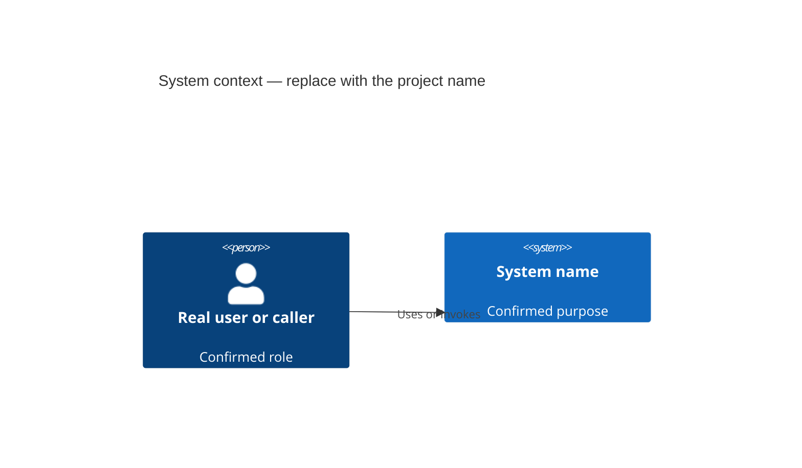

# Architecture

<!-- Before delivery, keep only sections with a current purpose; remove template comments, example rows, and empty headings. Adapt names and language to the project. Do not invent status, dates, owners, or evidence. -->

## Document status

- Scope:
- Current or proposed:
- Last reviewed:
- Related decisions:

## Context

<!-- For a complete documentation baseline, include a concise C4 system-context view here even for a small system. Use real actors/callers and confirmed external systems only. Use C4Context only when the target renderer supports it; otherwise use its supported flowchart syntax while preserving the same system boundary and relationships. Put the view's status (observed current, accepted target, proposed, or partly unverified) in its title/caption or adjacent prose; explain a genuine exception instead of silently omitting the view. -->

## Goals

-

## Non-goals

-

## Constraints and assumptions

### Constraints

-

### Assumptions

-

### Unknowns

-

## Architecture profiles

<!-- Omit profiles that were not assessed. -->

- Documentation:
- Architecture:
- Assurance:
- Planning:

## Solution strategy

<!-- Summarize the few choices that explain most of the design and why their complexity is proportional. -->

## Current or proposed architecture

<!-- State clearly whether this section describes observed current state, accepted target state, or a proposal. -->

## Major building blocks

| Building block | Responsibility | Owns | Depends on | Exposes |
|---|---|---|---|---|
|  |  |  |  |  |

<!-- Add a C4 container or component view only when the table and prose are insufficient. -->

## Dependency and boundary rules

-

## Data

### Ownership and sources of truth

-

### Consistency and transactions

-

### Migrations, retention, and recovery

-

## External integrations

| Integration | Purpose | Contract | Failure handling | Ownership |
|---|---|---|---|---|
|  |  |  |  |  |

## Runtime flows

<!-- The primary-use-case sequence belongs in the functional overview. Add architecture-level flows here only when they explain cross-cutting ordering, async behavior, trust changes, retries, or failure semantics. -->

### Flow: <!-- name -->

1.

Failure and recovery:

-

## Deployment

<!-- Describe runtime units, environments, state, networking, scaling, and recovery only to the depth that affects decisions. -->

## Cross-cutting concerns

### Security and privacy

-

### Reliability, retries, and idempotency

-

### Observability and auditability

-

### Testing and release safety

-

## Significant decisions

<!-- Link accepted or proposed ADRs; do not duplicate their full rationale. -->

-

## Risks and accepted debt

| Risk or debt | Impact | Mitigation or evidence | Revisit trigger |
|---|---|---|---|
|  |  |  |  |

## Revisit triggers

-

## Evidence and verification

<!-- Record relevant tests, measurements, prototypes, or inspections. Do not claim evidence that was not produced. -->

-
