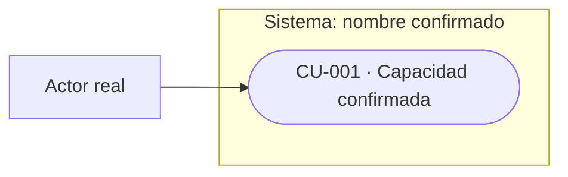
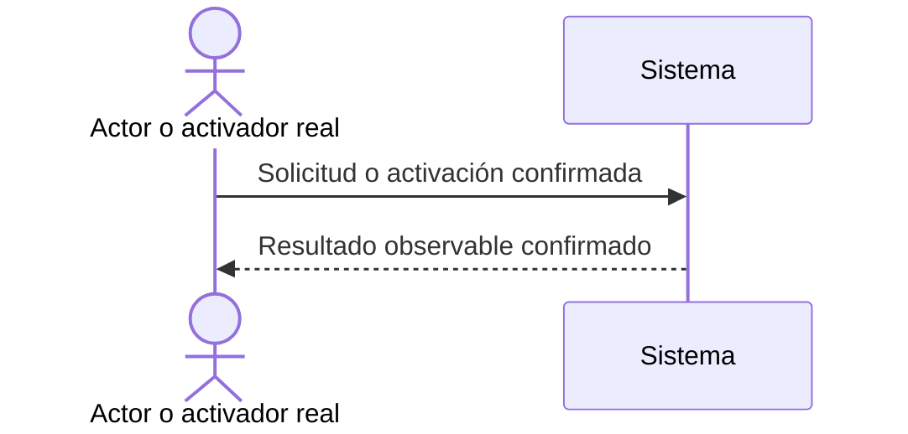

# Funcionalidad

<!-- Use for the functional overview in a complete software-documentation baseline. Keep it concise and evidence-based. Remove template comments, unsupported sections, and empty placeholders before delivery. -->

## Propósito y alcance funcional

<!-- State what the system enables and its important boundaries. Distinguish observed behavior from accepted target or proposal. -->

## Actores y capacidades

| ID | Actor real | Caso de uso / capacidad | Resultado observable | RF relacionados |
|---|---|---|---|---|
| CU-001 | [actor/activador real] | [capacidad confirmada] | [resultado observable] | RF-001 |

<!-- List only confirmed or explicitly proposed behavior. For a non-interactive service, use its real caller, trigger, or consuming system as the actor. -->

## Historias de usuario

<!-- Include one concise HU per meaningful user-facing capability (or real caller/consumer outcome). Link its RF IDs. Keep acceptance criteria with the canonical requirement instead of repeating them here. -->

| ID | Historia (Como / quiero / para) | Requisitos relacionados |
|---|---|---|
| HU-001 | Como [actor], quiero [capacidad] para [resultado observable]. | RF-001 |

## Casos de uso detallados

<!-- Detail only cataloged CU-### flows whose business rules, alternatives, errors, permissions, async behavior, or risk merit step-by-step documentation. A conventional login may be captured by a concise requirement and acceptance criteria instead. -->

### CU-001 — [flujo con decisiones relevantes]

- Actor/activador:
- Requisitos relacionados:
- Precondiciones:
- Flujo principal:
  1. [paso]
- Alternativas/fallos relevantes:
- Resultado observable:

## Vista de casos de uso

<!-- Include an editable view in every complete baseline. Prefer the repository's established format. Mermaid usecase-beta requires a compatible renderer; if unavailable, use a supported flowchart that clearly shows the system boundary, real actors, and capabilities they invoke. Never invent use cases to fill the diagram. Put the view's status (observed current, accepted target, proposed, or partly unverified) in its title/caption or adjacent prose. -->

<!-- Replace the example with the confirmed actors and capabilities; include a short prose explanation for readers of the source. -->

## Reglas y términos del dominio

<!-- Keep only rules or terms that materially affect behavior. Link to a focused document only when detail warrants it. -->

## Caso de uso principal

<!-- Choose the most representative or risk-reducing flow; do not assume it is the most common one. It may be a concise primary flow rather than a full CU specification. -->

- Actor o activador:
- Precondiciones:
- Flujo principal:
  1.
- Resultado observable:
- Alternativa o fallo relevante:

## Secuencia del caso de uso principal

<!-- Include an editable sequence view in every complete baseline. Use only evidenced participants and interactions. For a genuinely non-interactive system, show the real trigger/caller and processing path, or explain why another truthful view is needed. Put the view's status (observed current, accepted target, proposed, or partly unverified) in its title/caption or adjacent prose. -->

<!-- Replace every example participant and message with project evidence; mark a proposed or partly unverified flow explicitly. -->

## Referencias

- Arquitectura: [índice de arquitectura](../02-arquitectura/indice.md)
